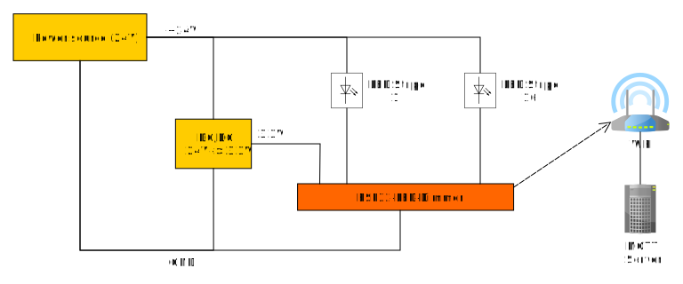
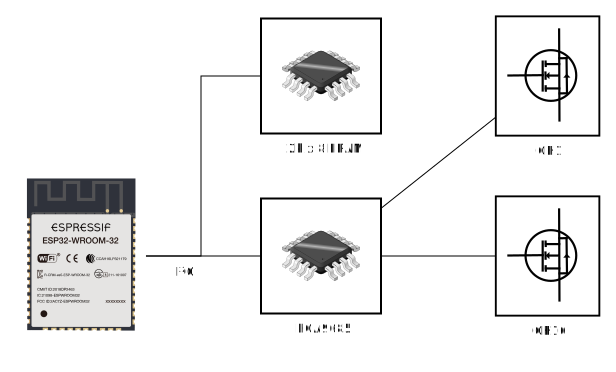
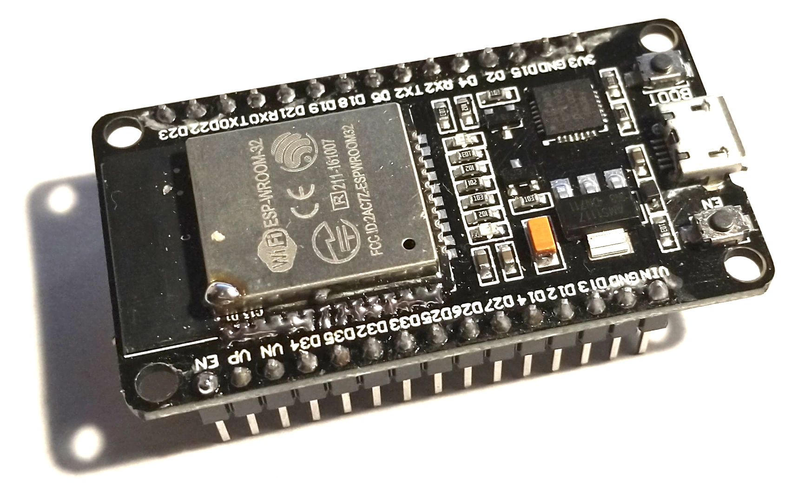
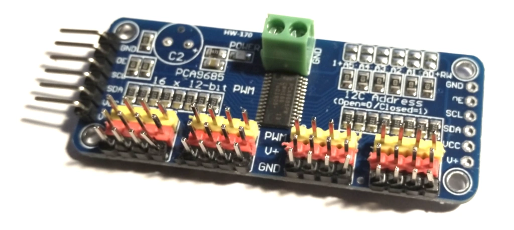
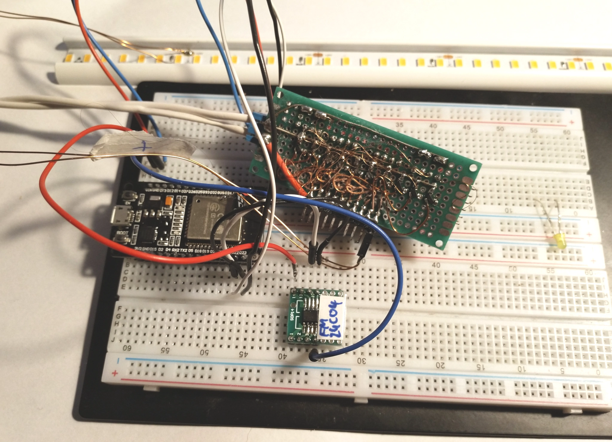

# 1. ESP32 LED Dimmer

[](https://github.com/zebrajaeger/esp32-led-dimmer/workflows/CI/badge.svg?branch=master)
[](https://www.gnu.org/licenses/lgpl-3.0)
[

## 1.1. Introducion

This thing is to connect a LED-Lamp (with up to 16 channels and 4096 steps resolution per channel) to a mqtt server

* ESP32 as µC
* PCA9685 as PWM device
  * Frequency of PWM between 25..1500Hz configurable
  * 4096 Brightness values to implement a good mapping for brightness curves
* FRAM MB85RC16 with 10^12 erase/write cycles for values
* Different mosfets possible (low gate volatge ist required because we working with 3,3V)
* Configuration is stored in ESP32 flash wich has 100.000 erase/write cycles
* MQTT control
* Keeps brightness value between power cycles
* Mostly fast connections to WiFi net (sometimes not, maybe a hardware/driver bug)
* If no WiFi connaction can etablished, it opens after 30 seconds a WiFi accesspoint to connect via Smartphone/Notebook to configure connections and credentials
* Simple schematic -  everything is connected via I²C bus
* Made to power on and off, i.e. for a updated light with an oldscool light switch

## 1.2. Simplified Diagram



## 1.3. Simplified Schematic

*You can find the complete schematic (and PCB) here:* <https://easyeda.com/zebrajaeger/led_dimmer_v2>



## 1.4. Motivation

 I tried some of these configurable projects (EasyESP, Tasmota, ESPHome, ...) but every solution of this list
 has big disadvantages like crashes, very slow wifi connection, no way to store the light brightnes values
 through power-cycles.
 At the end of this frustrating way I decided to write a software that matches (hopefully) all my requirements


## 1.5. TODO

- [ ] Consider username and password on mqtt connection.
- [ ] Implement mqtt port configuration.
- [ ] The Reconnector sometimes makes MQTT reconnects but maybe the underlaying TCP-Stack sends a wrong state. To be analyzed.
- [ ] More documentation.
- [X] Make PCB.
  - [X] With consider of jtag and reset + flash-button.
- [ ] Implement timer for periodic status updates.
  - [ ] And configuration of period time
- [ ] CSS tuning
- [ ] 'Homepage' and logo for embedded server
- [X] ~~~SSL Connections~~~ (possible?) Not possible.

## 1.6. Documentation

### 1.6.1. Installation

* Install platformio as described here: <https://platformio.org/install/ide?install=vscode>
* On the PIO Home tab within Visual Studio Code, go to the left toolbar and choose 'Platforms'
* Install 'Expressif 32' platform
* Clone this project into a directory of your choice or download it as a zip-file from here: <https://github.com/zebrajaeger/esp32-led-dimmer/archive/master.zip> (same link as 'Clone or download' -> 'Download ZIP')
* In the PIO Home tab choode 'Open Project' and choose the folder with the project files.

* Edit the platformio.ini and change the line

      upload_port = COM4
  to the serial port where youre device is connected to.

* Click on the 'Alien head' icon on the left toolbar. the 'Project Tasks' List should be visible now.
  
    1. Execute 'Upload File System Image'. This uploads the file-system-stuff.
    1. Execute 'Upload'. this uploads the firmware itself.

* If you don't have, change the platformio.ini file and change the 'monitor_port' line with your device port. Connect with the PlatformIO Serial Monitor (the plug icon at the bottom toolbar).

* Because there are no WiFI credentials set, after a timeout of around 30s the device will spawn a accespoint you connect to with your Notebook or Smartphone. The name of the SSID starts with 'ESP'

### 1.6.2. Storage

#### 1.6.2.1. Rarely written

We have two types of storage for data.
the first one is the flash which have a livetime of 100.000 erase/program cycles and is used for rarely written data:

* Firmware
* Configuration data from web-interface

#### 1.6.2.2. Often written

The second is a small FRAM, the the MB85RC16 (I²C, 3.3V) (<https://www.fujitsu.com/uk/Images/MB85RC16.pdf>)
which can be written 10^12 times per Byte. It is used to store the brightness values which may be changed very often.

### 1.6.3. Software

// TODO Only as code today, sorry
#### Configuration

#### MQTT

Dictionary:

* 'f': frequency (in Hz)
* 'd': data
* 'c': channel index (starts with 0)
* 'v': brightness value: 0..4096 as linear PWM brightness steps or a  percentage value as string, i.E. "35.7%". Can be a simple value or an array. Starts with channel index.

There are three topics:
* &lt;NodeName&gt;/alive
  * Device publishes 'true' after connection
  * On timeout the last will message is 'false'
* &lt;NodeName&gt;/state
  * After startup and change settings the device will publish a json status. Example:
  ```json
    {"f":1500,"d":{"c":0,"v":[1500,40,2048,99,2048,2048,2048,2048,2048,2048,2048,2048,2048,2048,2048,2048]}}
  ```
* &lt;NodeName&gt;/set
  * Device does not publish anything but subscribes to this channel. Format is a subset of the status message. You can set only the frequency or only one or more channel values.
### 1.6.4. Hardware 1 (for schematic)

I made the pcb with EASYEDA from JLPCB. A public link to this project is here: <https://easyeda.com/zebrajaeger/led_dimmer_v2>

#### 1.6.4.1. µC

* ESP32 (ESP32-WROOM-32)
  * Dual core, 240MHz  
  * Datasheet: <https://www.espressif.com/sites/default/files/documentation/esp32_datasheet_en.pdf>
  * Technical Reference Manual: <https://www.espressif.com/sites/default/files/documentation/esp32_technical_reference_manual_en.pdf>
  * Instruction set: <https://www.espressif.com/sites/default/files/documentation/esp32_at_instruction_set_and_examples_en.pdf>

For Development:

ESP32 devkit v1



#### 1.6.4.2. Mosfets

Every N-Channel Mosfet that is sure fully on @ 2.5V gate voltage

I use:

* IRLML6344 (37mΩ @ Ug=2.5V) <https://www.infineon.com/dgdl/irlml6344pbf.pdf?fileId=5546d462533600a4015356689c44262c>
* AO3400 (53mΩ @ Ug=2.5V) <http://www.aosmd.com/pdfs/datasheet/ao3400.pdf>

#### 1.6.4.3. FRAM

Requirements:

* I²C, min 400kHz
* 3.3V VDD
* Single adress byte (bigger FRAMs using two bytes for the bigger address space)

I use:

* MB85RC16 (16K=2K×8) (<https://www.fujitsu.com/uk/Images/MB85RC16.pdf>)

#### 1.6.4.4. PCA9685

* TSSOP28
* <https://www.nxp.com/docs/en/data-sheet/PCA9685.pdf>

For development: PCA9685 module from ebay:



#### 1.6.4.5. DC/DC

* ESP needs up to 0.5A @3.3V (peak value). Average current consumption is 80mA.

I use 24V LED so some DC/DC modules from ebay/aliexpress are fine.

* Cheap and small are MP1584 based buck convertert (search for MP1584 on Ebay, Aliexpress or Amazon)
  * 4.5-28V to 0.8-20V and 3A (manually adjust it to 3.3V ad glue the trimmer)
  * <https://www.monolithicpower.com/en/documentview/productdocument/index/version/2/document_type/Datasheet/lang/en/sku/MP1584/document_id/204>

### 1.6.5. Hardware 2 (external components)

#### 1.6.5.1. AC/DC

I decidet to use a high efficient transformer from Enertex (<http://www.enertex.de/e-led-powersupply.html>) which is explicit designed for PWM applications. The only disadvantage is the non waterproof design.

#### 1.6.5.2. LED stripes

I use high CRI 24V LED stripes from <https://shop.led-studien.de/> with aluminium profiles as case and heatsink.

<a id="example-schematic"></a>

### 1.6.6. Hardware 3 (example schematic)



## 1.7. Tools I used for development

### 1.7.1. Software

* Visual Studio Code + PlatformIO
* EasyEDA to create the PCB
  * JLPCB to build the PCBS
  * AISLER <https://aisler.net> to build PCBs (more environment friendly than JLPCB because no delivery via aeroplane and default leadfree. JLPCB also provides leadfree PCBs but then the whole costs are higher than the tax-free threshold duty of 22€ in 2019).
* Gimp to work with images <https://www.gimp.org/>
* Sometimes Putty to connect to serial port (Serial console implementation of PlatformIO seems not to stable)

### 1.7.2. Hardware

For details see the hardware section
* Esp32 DevKit v1
* PCA9685 module from ebay
* Breadboard
* Prototype PCB for MOSFETs (I forgot to order adapter PCBs)
* SOP-8 Adapter PCB from ebay for FRAM

### Extended Docs
* Github Markdown: <https://github.github.com/gfm/>
* Github Markdown Code Blocks: <https://help.github.com/en/github/writing-on-github/creating-and-highlighting-code-blocks>